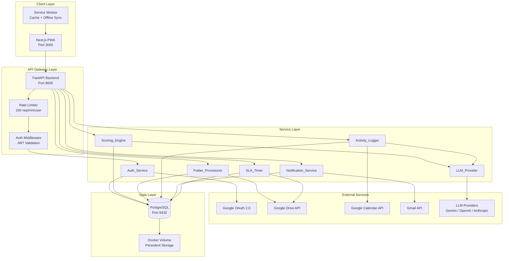
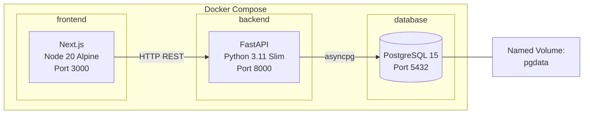
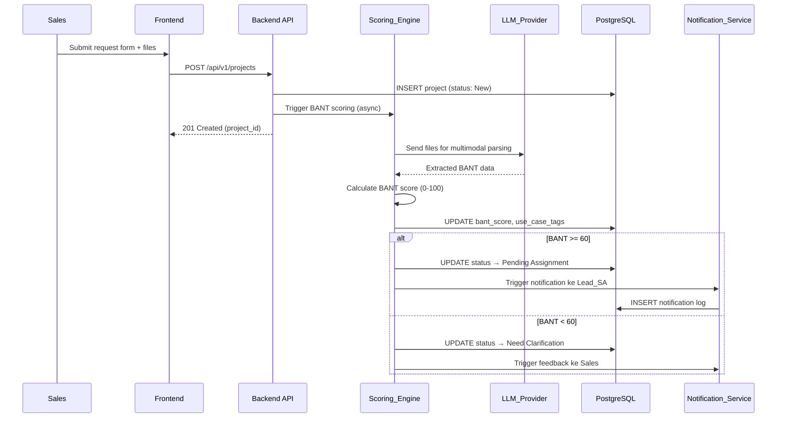
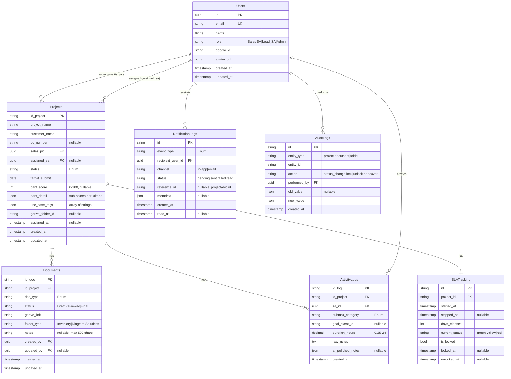

# Design Document — Portal SA MVP

## Overview

Portal SA adalah Progressive Web App (PWA) yang menggantikan Redmine untuk manajemen proyek pre-sales dan pencatatan aktivitas harian Solutions Architect. Aplikasi ini menggunakan arsitektur **decoupled frontend-backend** dengan Next.js sebagai frontend dan FastAPI sebagai backend, ditenagai oleh Google Workspace APIs dan Google Gemini AI melalui abstraction layer multi-provider.

### Tujuan Desain

1. **Rapid Development** — Arsitektur sederhana yang memungkinkan delivery cepat untuk MVP
2. **Portabilitas** — Deploy di environment manapun via Docker Compose
3. **Extensibility** — LLM Provider abstraction agar tidak tightly-coupled ke satu vendor AI
4. **Integration-First** — Memanfaatkan ekosistem Google Workspace sebagai backbone kolaborasi

### Keputusan Arsitektur Utama

| Keputusan | Pilihan | Alasan |
|-----------|---------|--------|
| Frontend Framework | Next.js 14+ (App Router) | SSR/SSG, PWA support, React ecosystem |
| Backend Framework | FastAPI (Python 3.11+) | Async native, auto OpenAPI docs, AI/ML ecosystem |
| Database | PostgreSQL 15+ | Relational + JSON support, mature ecosystem |
| AI Integration | LLM Provider Abstraction Layer | Multi-vendor support, hot-reload config |
| Auth | Google OAuth 2.0 | Single sign-on dengan Google Workspace |
| Deployment | Docker + Docker Compose | Portabel, konsisten antar environment |
| State Management | Zustand (frontend) | Lightweight, minimal boilerplate |
| API Communication | REST + SWR (frontend caching) | Simple, auto-documented via OpenAPI |

---

## Architecture

### High-Level Architecture Diagram



### Container Architecture



### Sequence Diagram — Pre-Sales Request Flow



---

## Components and Interfaces

### 1. Auth_Service

**Tanggung jawab:** Mengelola autentikasi Google OAuth 2.0, session management, dan role-based access control.

```python
# Interfaces
class AuthService:
    async def initiate_oauth(self, redirect_uri: str) -> str:
        """Mengembalikan URL Google OAuth consent."""
        ...

    async def handle_callback(self, code: str) -> TokenPair:
        """Menukar authorization code dengan access + refresh token."""
        ...

    async def validate_domain(self, email: str) -> bool:
        """Validasi apakah domain email ada di whitelist."""
        ...

    async def refresh_token(self, refresh_token: str) -> TokenPair:
        """Refresh access token yang kedaluwarsa."""
        ...

    async def get_or_create_user(self, google_profile: GoogleProfile) -> User:
        """Upsert user berdasarkan Google profile."""
        ...

    async def revoke_session(self, user_id: str) -> None:
        """Mengakhiri session pengguna."""
        ...
```

**Konfigurasi:**
```
GOOGLE_CLIENT_ID=xxx
GOOGLE_CLIENT_SECRET=xxx
GOOGLE_REDIRECT_URI=http://localhost:8000/api/v1/auth/callback
ALLOWED_DOMAINS=company.com,partner.com
ROLE_MAPPING={"admin@company.com": "Lead_SA", "@sales.company.com": "Sales"}
SESSION_TTL_HOURS=24
```

### 2. Scoring_Engine

**Tanggung jawab:** Menganalisis dokumen attachment via LLM untuk menghasilkan BANT Score dan use case tags.

```python
class ScoringEngine:
    async def score_documents(self, project_id: str, files: list[UploadedFile]) -> BANTResult:
        """Kirim file ke LLM untuk ekstraksi BANT, hitung skor."""
        ...

    async def score_manual(self, project_id: str, bant_input: ManualBANTInput) -> BANTResult:
        """Hitung BANT score dari input manual Sales."""
        ...

    async def apply_threshold(self, project_id: str, score: int) -> str:
        """Terapkan threshold gating (>= 60 lolos, < 60 klarifikasi)."""
        ...

    async def search_similar_projects(
        self, use_case_tags: list[str], exclude_project_id: str
    ) -> list[RecommendedDoc]:
        """RAG: Cari proyek Closed-Win yang mirip berdasarkan tags."""
        ...
```

**BANT Scoring Algorithm:**
```
Untuk setiap kriteria (Budget, Authority, Need, Timeline):
  - Eksplisit ditemukan dalam dokumen → 25 poin
  - Parsial/implisit → 10-20 poin (ditentukan LLM)
  - Tidak ditemukan → 0 poin

Total BANT_Score = Budget + Authority + Need + Timeline (0-100)
Threshold: >= 60 → "Pending Assignment", < 60 → "Need Clarification"
```

### 3. Folder_Provisioner

**Tanggung jawab:** Auto-provisioning folder structure di Google Drive dan mengelola permission.

```python
class FolderProvisioner:
    async def provision_project_folder(
        self, project: Project, sa_email: str, lead_sa_email: str, sales_email: str
    ) -> str:
        """Buat folder master + subfolder, set permission. Return folder_id."""
        ...

    async def lock_solutions_folder(self, project_id: str, sales_email: str) -> None:
        """Hapus akses Sales ke folder Solutions (SLA auto-lock)."""
        ...

    async def unlock_solutions_folder(self, project_id: str, sales_email: str) -> None:
        """Kembalikan akses Viewer untuk Sales ke folder Solutions."""
        ...

    async def provision_handover(
        self, project_id: str, pmo_email: str, delivery_email: str
    ) -> None:
        """Buat subfolder Final_Deliverables, tambah permission PMO & Delivery."""
        ...

    def sanitize_folder_name(self, name: str) -> str:
        """Ganti karakter tidak valid dengan underscore."""
        ...
```

**Folder Structure:**
```
[Customer_Name] - [Project_Name]/
├── Inventory/    (Viewer: Sales, Editor: SA + Lead_SA)
├── Diagram/      (Editor: SA + Lead_SA, No Access: Sales)
└── Solutions/    (Editor: SA + Lead_SA, No Access: Sales → Viewer setelah DQ)
    └── Final_Deliverables/  (dibuat saat handover)
```

### 4. Activity_Logger

**Tanggung jawab:** Mencatat aktivitas harian SA, integrasi Google Calendar, dan AI note polishing.

```python
class ActivityLogger:
    async def create_log(self, log_input: ActivityLogInput) -> ActivityLog:
        """Simpan activity log dan trigger AI polishing."""
        ...

    async def polish_notes(self, raw_notes: str) -> PolishedNotes | None:
        """Kirim raw notes ke LLM untuk structuring."""
        ...

    async def retry_polish(self, log_id: str) -> PolishedNotes | None:
        """Re-trigger polishing untuk log yang gagal sebelumnya."""
        ...

    async def sync_calendar(self, sa_id: str) -> list[CalendarEvent]:
        """Fetch events dari GCal (7 hari lalu + 7 hari depan)."""
        ...

    async def map_event_to_project(
        self, event_id: str, project_id: str, sa_id: str
    ) -> ActivityLog:
        """Petakan event GCal ke proyek sebagai activity log."""
        ...

    async def get_project_story(
        self, project_id: str, filters: StoryFilter
    ) -> PaginatedResult[ActivityLog]:
        """Ambil timeline aktivitas proyek dengan filter dan pagination."""
        ...
```

### 5. Notification_Service

**Tanggung jawab:** Mengelola notifikasi in-app dan email (Gmail API) dengan graceful fallback.

```python
class NotificationService:
    async def send_notification(self, event: NotificationEvent) -> None:
        """Kirim notifikasi in-app + email (jika tersedia)."""
        ...

    async def send_email(self, to: str, template: str, context: dict) -> bool:
        """Kirim email via Gmail API. Return False jika gagal/tidak dikonfigurasi."""
        ...

    async def get_user_notifications(
        self, user_id: str, page: int, per_page: int = 20
    ) -> PaginatedResult[Notification]:
        """Ambil riwayat notifikasi user dengan pagination."""
        ...

    async def mark_as_read(self, notification_id: str, user_id: str) -> None:
        """Tandai notifikasi sebagai dibaca."""
        ...
```

**Notification Event Types:**
```python
class NotificationEventType(str, Enum):
    ASSIGNMENT = "assignment"           # SA ditugaskan ke proyek
    STATUS_CHANGE = "status_change"     # Status proyek berubah
    SLA_REMINDER = "sla_reminder"       # H+3 DQ Number reminder
    SLA_ESCALATION = "sla_escalation"   # H+5 eskalasi ke Sales Manager
    HANDOVER = "handover"               # Handover ke PMO/Delivery
    DOC_READY = "doc_ready"             # Dokumen siap review
```

### 6. SLA_Timer

**Tanggung jawab:** Menghitung countdown DQ Number dan memicu auto-lock/unlock serta eskalasi.

```python
class SLATimer:
    async def start_timer(self, project_id: str, assigned_at: datetime) -> None:
        """Mulai tracking SLA untuk proyek yang baru di-assign."""
        ...

    async def check_sla_status(self, project_id: str) -> SLAStatus:
        """Hitung hari elapsed, tentukan status SLA (green/yellow/red)."""
        ...

    async def process_sla_actions(self) -> None:
        """Cron job: cek semua proyek aktif, trigger reminder/eskalasi/lock."""
        ...

    async def stop_timer(self, project_id: str) -> None:
        """Hentikan timer saat DQ Number diinput."""
        ...
```

**SLA Logic:**
```
Hari 0-2: Badge hijau (normal)
Hari 3-4: Badge kuning + kirim reminder ke Sales (H+3)
Hari 5+:  Badge merah + eskalasi ke Sales Manager + auto-lock folder Solutions
```

### 7. LLM_Provider

**Tanggung jawab:** Abstraction layer untuk komunikasi dengan LLM providers (Gemini, OpenAI, Anthropic, dll.)

```python
# Interface (Protocol)
class LLMProviderInterface(Protocol):
    async def complete_text(self, prompt: str, **kwargs) -> LLMResponse:
        """Text completion."""
        ...

    async def parse_document(self, file_content: bytes, mime_type: str, prompt: str) -> LLMResponse:
        """Multimodal document parsing."""
        ...

    async def structure_text(self, text: str, output_schema: dict) -> LLMResponse:
        """Text structuring dengan expected output format."""
        ...


# Concrete Adapter (Default)
class GeminiAdapter(LLMProviderInterface):
    """Adapter untuk Google Gemini API."""
    ...

class OpenAIAdapter(LLMProviderInterface):
    """Adapter untuk OpenAI API (future)."""
    ...

# Factory + Registry
class LLMProviderFactory:
    _adapters: dict[str, type[LLMProviderInterface]] = {}
    _current_provider: LLMProviderInterface | None = None

    def register_adapter(self, name: str, adapter_class: type[LLMProviderInterface]) -> None:
        """Daftarkan adapter baru (Open-Closed Principle)."""
        ...

    def get_provider(self) -> LLMProviderInterface:
        """Ambil provider aktif berdasarkan env config."""
        ...

    async def reload_config(self) -> None:
        """Hot-reload config tanpa restart (maks 30 detik)."""
        ...
```

**Konfigurasi:**
```
LLM_PROVIDER=gemini
LLM_API_ENDPOINT=https://generativelanguage.googleapis.com/v1
LLM_API_KEY=xxx
LLM_MODEL_NAME=gemini-1.5-flash
```

**Retry Strategy:**
```
Exponential backoff: 1s → 2s → 4s (3 kali max)
Timeout per request: 30 detik
Fallback: gunakan config terakhir yang valid jika config baru gagal
```

### 8. Container_Orchestrator

**Tanggung jawab:** Docker Compose setup untuk menjalankan seluruh service dengan dependency management.

```yaml
# docker-compose.yml (structure overview)
services:
  database:
    image: postgres:15-alpine
    volumes: [pgdata:/var/lib/postgresql/data]
    healthcheck: pg_isready
    restart: on-failure:3

  backend:
    build: ./backend (multi-stage)
    depends_on: database (healthy)
    ports: ["8000:8000"]
    env_file: .env
    healthcheck: /health endpoint
    restart: on-failure:3

  frontend:
    build: ./frontend (multi-stage)
    depends_on: backend (healthy)
    ports: ["3000:3000"]
    restart: on-failure:3

volumes:
  pgdata:
```

---

## Data Models

### Entity Relationship Diagram



### Detailed Table Schemas

#### Users
```sql
CREATE TABLE users (
    id UUID PRIMARY KEY DEFAULT gen_random_uuid(),
    email VARCHAR(255) UNIQUE NOT NULL,
    name VARCHAR(255) NOT NULL,
    role VARCHAR(20) NOT NULL DEFAULT 'SA'
        CHECK (role IN ('Sales', 'SA', 'Lead_SA', 'Admin')),
    google_id VARCHAR(255) UNIQUE NOT NULL,
    avatar_url TEXT,
    created_at TIMESTAMP WITH TIME ZONE DEFAULT NOW(),
    updated_at TIMESTAMP WITH TIME ZONE DEFAULT NOW()
);
```

#### Projects
```sql
CREATE TABLE projects (
    id_project VARCHAR(50) PRIMARY KEY,
    project_name VARCHAR(150) NOT NULL,
    customer_name VARCHAR(150) NOT NULL,
    dq_number VARCHAR(20),
    sales_pic UUID NOT NULL REFERENCES users(id),
    assigned_sa UUID REFERENCES users(id),
    status VARCHAR(30) NOT NULL DEFAULT 'New'
        CHECK (status IN ('New', 'Pending Assignment', 'Assigned',
                          'Ready', 'Closed-Win', 'Handover Complete', 'Lost',
                          'Need Clarification', 'Scoring Pending', 'Manual Review Required')),
    target_submit DATE NOT NULL,
    bant_score INTEGER CHECK (bant_score BETWEEN 0 AND 100),
    bant_detail JSONB,
    use_case_tags JSONB DEFAULT '[]'::jsonb,
    gdrive_folder_id VARCHAR(255),
    assigned_at TIMESTAMP WITH TIME ZONE,
    created_at TIMESTAMP WITH TIME ZONE DEFAULT NOW(),
    updated_at TIMESTAMP WITH TIME ZONE DEFAULT NOW()
);

-- Validasi DQ Number format (alfanumerik + hyphen, 5-20 karakter)
ALTER TABLE projects ADD CONSTRAINT chk_dq_number_format
    CHECK (dq_number IS NULL OR dq_number ~ '^[A-Za-z0-9\-]{5,20}$');
```

#### Documents
```sql
CREATE TABLE documents (
    id_doc VARCHAR(50) PRIMARY KEY,
    id_project VARCHAR(50) NOT NULL REFERENCES projects(id_project),
    doc_type VARCHAR(20) NOT NULL
        CHECK (doc_type IN ('PropTek', 'BOQ', 'Mandays', 'MoM', 'RFP', 'HLD')),
    status VARCHAR(20) NOT NULL DEFAULT 'Draft'
        CHECK (status IN ('Draft', 'Reviewed', 'Final')),
    gdrive_link TEXT NOT NULL,
    folder_type VARCHAR(20) NOT NULL
        CHECK (folder_type IN ('Inventory', 'Diagram', 'Solutions')),
    notes VARCHAR(500),
    created_by UUID NOT NULL REFERENCES users(id),
    updated_by UUID REFERENCES users(id),
    created_at TIMESTAMP WITH TIME ZONE DEFAULT NOW(),
    updated_at TIMESTAMP WITH TIME ZONE DEFAULT NOW()
);
```

#### ActivityLogs
```sql
CREATE TABLE activity_logs (
    id_log VARCHAR(50) PRIMARY KEY,
    id_project VARCHAR(50) NOT NULL REFERENCES projects(id_project),
    sa_id UUID NOT NULL REFERENCES users(id),
    subtask_category VARCHAR(50) NOT NULL
        CHECK (subtask_category IN (
            'Meeting Pre-Sales', 'Create PropTek', 'Create BOQ',
            'Peer Review', 'Internal Discussion', 'Customer Workshop'
        )),
    gcal_event_id VARCHAR(255),
    duration_hours DECIMAL(5,2) NOT NULL
        CHECK (duration_hours BETWEEN 0.25 AND 24.00),
    raw_notes TEXT NOT NULL,
    ai_polished_notes JSONB,
    created_at TIMESTAMP WITH TIME ZONE DEFAULT NOW()
);

-- Unik constraint: 1 event GCal hanya bisa di-map ke 1 project
CREATE UNIQUE INDEX idx_unique_gcal_mapping
    ON activity_logs(gcal_event_id) WHERE gcal_event_id IS NOT NULL;
```

#### NotificationLogs
```sql
CREATE TABLE notification_logs (
    id VARCHAR(50) PRIMARY KEY,
    event_type VARCHAR(30) NOT NULL
        CHECK (event_type IN ('assignment', 'status_change', 'sla_reminder',
                              'sla_escalation', 'handover', 'doc_ready')),
    recipient_user_id UUID NOT NULL REFERENCES users(id),
    channel VARCHAR(10) NOT NULL CHECK (channel IN ('in-app', 'email')),
    status VARCHAR(10) NOT NULL DEFAULT 'pending'
        CHECK (status IN ('pending', 'sent', 'failed', 'read')),
    reference_id VARCHAR(50),
    metadata JSONB,
    created_at TIMESTAMP WITH TIME ZONE DEFAULT NOW(),
    read_at TIMESTAMP WITH TIME ZONE
);
```

#### AuditLogs
```sql
CREATE TABLE audit_logs (
    id VARCHAR(50) PRIMARY KEY,
    entity_type VARCHAR(30) NOT NULL,
    entity_id VARCHAR(50) NOT NULL,
    action VARCHAR(50) NOT NULL,
    performed_by UUID NOT NULL REFERENCES users(id),
    old_value JSONB,
    new_value JSONB NOT NULL,
    created_at TIMESTAMP WITH TIME ZONE DEFAULT NOW()
);
```

#### SLATracking
```sql
CREATE TABLE sla_tracking (
    id VARCHAR(50) PRIMARY KEY,
    project_id VARCHAR(50) NOT NULL REFERENCES projects(id_project) UNIQUE,
    started_at TIMESTAMP WITH TIME ZONE NOT NULL,
    stopped_at TIMESTAMP WITH TIME ZONE,
    days_elapsed INTEGER NOT NULL DEFAULT 0,
    current_status VARCHAR(10) NOT NULL DEFAULT 'green'
        CHECK (current_status IN ('green', 'yellow', 'red')),
    is_locked BOOLEAN NOT NULL DEFAULT FALSE,
    locked_at TIMESTAMP WITH TIME ZONE,
    unlocked_at TIMESTAMP WITH TIME ZONE
);
```


---

## Correctness Properties

*A property is a characteristic or behavior that should hold true across all valid executions of a system — essentially, a formal statement about what the system should do. Properties serve as the bridge between human-readable specifications and machine-verifiable correctness guarantees.*

### Property 1: Domain Whitelist Validation

*For any* email address, the Auth_Service SHALL accept the address if and only if its domain (bagian setelah @) terdapat dalam daftar whitelist yang dikonfigurasi. Email dengan domain di luar whitelist selalu ditolak, dan email dengan domain di whitelist selalu diterima.

**Validates: Requirements 1.3**

### Property 2: User Upsert Idempotence

*For any* valid Google profile, jika pengguna belum ada di database maka Auth_Service SHALL membuat record baru, dan jika pengguna sudah ada maka Auth_Service SHALL memperbarui data tanpa membuat duplikat. Hasil akhir selalu tepat 1 record per google_id.

**Validates: Requirements 1.4**

### Property 3: Project Form Input Validation

*For any* kombinasi input form request (project_name, customer_name, target_submit, estimasi_nilai, files), Portal_SA SHALL menerima input jika dan hanya jika: project_name ≤ 150 karakter dan tidak kosong, customer_name ≤ 150 karakter dan tidak kosong, target_submit bukan tanggal di masa lalu, estimasi_nilai dalam rentang 0.01–999,999,999,999.00, dan setiap file berformat PDF/DOCX dengan ukuran ≤ 20MB. Input yang melanggar constraint ditolak dengan pesan validasi per-field.

**Validates: Requirements 2.1, 2.3**

### Property 4: Project Record Creation Invariant

*For any* form submission yang lolos validasi, Portal_SA SHALL membuat record baru di tabel Projects dengan status "New", timestamp pembuatan yang tidak null, dan sales_pic yang merujuk ke user yang membuat.

**Validates: Requirements 2.2**

### Property 5: File Upload Partial Failure Isolation

*For any* batch upload yang mengandung campuran file valid dan invalid (format salah, ukuran melebihi batas, timeout), Portal_SA SHALL menyimpan semua file yang berhasil dan hanya menampilkan error pada file yang gagal. Jumlah file tersimpan + file gagal = total file yang diupload.

**Validates: Requirements 2.6**

### Property 6: BANT Score Calculation Correctness

*For any* set sub-skor BANT (Budget: 0-25, Authority: 0-25, Need: 0-25, Timeline: 0-25), total BANT_Score SHALL sama dengan penjumlahan keempat sub-skor, berada dalam rentang 0-100, dan setiap sub-skor individual berada dalam rentang yang valid.

**Validates: Requirements 3.2, 3.7**

### Property 7: BANT Threshold Gating

*For any* BANT_Score yang dihitung (0-100), Portal_SA SHALL mengubah status proyek menjadi "Pending Assignment" jika score >= 60, dan "Need Clarification" jika score < 60. Tidak ada score yang menghasilkan status lain dari kedua kemungkinan tersebut.

**Validates: Requirements 3.4, 3.5**

### Property 8: File Type Filtering

*For any* kumpulan file attachment, Scoring_Engine SHALL hanya memproses file berformat PDF atau DOCX dan melewatkan semua format lainnya. Jumlah file yang diproses ≤ jumlah total file, dan setiap file yang diproses memiliki mime type PDF atau DOCX.

**Validates: Requirements 3.10**

### Property 9: Folder Name Sanitization

*For any* string Customer_Name atau Project_Name, hasil sanitization oleh Folder_Provisioner SHALL tidak mengandung karakter `/`, `\`, `*`, `?`, atau `"`, dan setiap karakter tidak valid dalam input diganti dengan underscore `_`. Panjang output ≥ panjang input dikurangi karakter yang dihapus.

**Validates: Requirements 5.7**

### Property 10: DQ Number Format Validation

*For any* string input sebagai DQ Number, Portal_SA SHALL menerima input jika dan hanya jika: hanya terdiri dari karakter alfanumerik dan tanda hubung, dengan panjang 5-20 karakter. Semua input yang tidak memenuhi kriteria ditolak.

**Validates: Requirements 6.5**

### Property 11: Document Status State Machine

*For any* dokumen dengan status tertentu dan attempted transition, Portal_SA SHALL hanya mengizinkan transisi Draft → Reviewed dan Reviewed → Final. Semua transisi lain (termasuk Draft → Final, Final → Draft, dan self-transitions) ditolak. Setiap transisi yang berhasil mencatat timestamp dan user yang mengubah.

**Validates: Requirements 7.3, 7.5**

### Property 12: Activity Log Input Validation

*For any* input activity log, Activity_Logger SHALL menerima input jika dan hanya jika: project_id valid dan tidak kosong, subtask_category dalam daftar yang didukung, duration_hours dalam rentang 0.25–24.00 dengan kelipatan 0.25, dan raw_notes tidak kosong dengan panjang ≤ 5000 karakter.

**Validates: Requirements 8.1, 8.2**

### Property 13: Project Story Filtering Correctness

*For any* query dengan filter subtask_category dan/atau rentang tanggal pada project story, hasil yang dikembalikan SHALL hanya berisi entry yang memenuhi semua filter yang diterapkan. Jumlah hasil ≤ total entry proyek, dan setiap entry dalam hasil memiliki category dan created_at yang sesuai filter.

**Validates: Requirements 8.5**

### Property 14: Project Workflow State Machine

*For any* proyek dengan status saat ini dan attempted transition oleh user dengan role tertentu, Portal_SA SHALL hanya mengizinkan transisi yang valid: New → Pending Assignment → Assigned → Ready → Closed-Win → Handover Complete. Status "Lost" hanya dapat diterapkan oleh Lead_SA dari status manapun kecuali "Handover Complete". Semua transisi tidak valid ditolak.

**Validates: Requirements 9.4, 9.5**

### Property 15: Audit Log Completeness on Status Change

*For any* perubahan status proyek yang berhasil, Portal_SA SHALL membuat entry audit log yang berisi: timestamp perubahan, status sebelumnya, status baru, dan user_id yang melakukan perubahan. Tidak ada perubahan status tanpa audit log.

**Validates: Requirements 9.6**

### Property 16: API Response Format Consistency

*For any* API response (success maupun error) dari backend Portal_SA, response body SHALL mengikuti format `{"status": "success"|"error", "data": {...}, "message": "..."}`. Tidak ada endpoint yang mengembalikan format berbeda.

**Validates: Requirements 11.1**

### Property 17: Calendar Event Mapping Uniqueness

*For any* Google Calendar event yang sudah dipetakan ke satu proyek, percobaan mapping event yang sama ke proyek lain SHALL ditolak. Setiap gcal_event_id hanya boleh muncul sekali di tabel activity_logs.

**Validates: Requirements 13.4**

### Property 18: Notification Log Completeness

*For any* notification event yang di-trigger (assignment, status_change, sla_reminder, sla_escalation, handover, doc_ready), Notification_Service SHALL membuat record di NotificationLogs dengan event_type, recipient_user_id, channel, status, dan timestamp yang tidak null.

**Validates: Requirements 14.1**

### Property 19: RAG Recommendation Tag Matching and Ordering

*For any* set use_case_tags proyek saat ini dan kumpulan proyek Closed-Win, hasil rekomendasi SHALL: (1) hanya berisi proyek dengan minimal 1 tag yang sama, (2) diurutkan descending berdasarkan jumlah tag cocok, dan (3) berisi maksimal 5 item.

**Validates: Requirements 15.2, 15.3**

### Property 20: SLA Timer Day-Based Actions

*For any* proyek yang berstatus "Assigned" tanpa DQ Number, dengan days_elapsed dihitung dari assigned_at: badge SHALL berwarna hijau untuk 0-2 hari, kuning untuk 3-4 hari, dan merah untuk 5+ hari. Reminder terkirim tepat saat hari ke-3, eskalasi + auto-lock terjadi tepat saat hari ke-5.

**Validates: Requirements 16.2, 16.3, 16.7**

### Property 21: LLM Provider Response Standardization

*For any* response dari LLM Provider (baik sukses maupun error, dari adapter manapun), format internal yang dikembalikan ke modul pemanggil SHALL selalu mengandung: status operasi (success/error), hasil teks terstruktur (atau null jika error), dan metadata. Jika semua retry gagal, error response SHALL mengandung indikasi jenis kegagalan (timeout, authentication error, atau invalid response).

**Validates: Requirements 18.5, 18.9**

### Property 22: LLM Retry Exponential Backoff

*For any* error response dari LLM Provider, retry SHALL dilakukan dengan interval exponential backoff: percobaan ke-1 setelah 1 detik, ke-2 setelah 2 detik, ke-3 setelah 4 detik. Tidak ada retry ke-4. Timeout per request 30 detik.

**Validates: Requirements 18.6**

---

## Error Handling

### Strategi Error Handling Global

Portal SA menggunakan pendekatan **graceful degradation** di mana kegagalan pada satu komponen tidak menghentikan seluruh sistem.

### Error Categories dan Response

| Category | HTTP Code | Behavior | Contoh |
|----------|-----------|----------|--------|
| Validation Error | 422 | Return detail per-field | Form input tidak valid |
| Authentication Error | 401 | Redirect ke login | Token expired/invalid |
| Authorization Error | 403 | Return forbidden message | Sales coba edit Final doc |
| Rate Limit | 429 | Return Retry-After header | > 100 req/min/user |
| External Service Error | 200 (degraded) | Graceful fallback | Gmail API down → in-app only |
| Internal Server Error | 500 | Log + generic message | Unhandled exception |

### Per-Service Error Handling

#### Auth_Service
- OAuth callback error → redirect ke login + error message
- Domain validation fail → 401 + domain tidak diizinkan
- Refresh token expired → end session + redirect login

#### Scoring_Engine
- LLM timeout (30s) → retry 3x interval 10s → "Manual Review Required"
- Invalid file format → skip file + log warning
- No valid files → redirect ke BANT Manual

#### Folder_Provisioner
- GDrive API error → retry 3x interval 5s → "Provisioning Failed" flag
- Permission error → retry 3x → notify Lead_SA
- Invalid folder name chars → sanitize dengan underscore

#### Activity_Logger
- LLM polishing gagal → simpan raw_notes, ai_polished_notes = null, tampilkan "Polish Ulang"
- Calendar API timeout (15s) → error message, data existing tetap aman
- Duplicate event mapping → error message + block

#### Notification_Service
- Gmail API unavailable → graceful fallback ke in-app saja
- Email send error (temporary) → retry 3x interval 30s → log failed
- Gmail API unconfigured → in-app only, tanpa error ke user

#### SLA_Timer
- GDrive lock/unlock error → retry 3x interval 5s → "Lock/Unlock Pending" badge
- Timer calculation error → log + alert admin

#### LLM_Provider
- Provider unreachable → exponential backoff 1s→2s→4s → error ke caller
- Invalid config → fallback ke last known good config
- Format response tidak sesuai → treat as error, trigger retry

### Error Response Format (Standar)

```json
{
  "status": "error",
  "data": {
    "errors": [
      {
        "field": "project_name",
        "reason": "Field tidak boleh kosong"
      }
    ]
  },
  "message": "Validasi gagal. Silakan periksa input Anda."
}
```

### Logging Strategy

```python
# Semua error dicatat dengan konteks lengkap
logger.error(
    "Scoring failed",
    extra={
        "project_id": project_id,
        "error_type": "llm_timeout",
        "retry_count": 3,
        "duration_ms": 30000,
    }
)
```

---

## Testing Strategy

### Overview

Testing Portal SA menggunakan **dual approach**: unit tests untuk contoh spesifik dan edge cases, serta property-based tests untuk memverifikasi universal properties di seluruh input space.

### Testing Stack

| Layer | Tool | Purpose |
|-------|------|---------|
| Property-Based Testing | Hypothesis (Python) | Verify correctness properties pada backend |
| Unit Testing | pytest + pytest-asyncio | Backend unit tests |
| Frontend Unit | Jest + React Testing Library | Component tests |
| Integration | pytest + httpx | API endpoint tests |
| E2E | Playwright | Full flow tests |
| Performance | Lighthouse CI | PWA + performance checks |

### Property-Based Testing Configuration

- **Library:** Hypothesis (Python) — mature PBT library untuk Python ecosystem
- **Minimum iterations:** 100 per property test
- **Tag format:** `# Feature: sa-portal-mvp, Property {number}: {title}`

### Test Categories

#### 1. Property-Based Tests (22 properties)

Setiap correctness property di atas diimplementasikan sebagai satu property-based test menggunakan Hypothesis. Contoh:

```python
from hypothesis import given, strategies as st, settings

# Feature: sa-portal-mvp, Property 6: BANT Score Calculation Correctness
@settings(max_examples=100)
@given(
    budget=st.integers(min_value=0, max_value=25),
    authority=st.integers(min_value=0, max_value=25),
    need=st.integers(min_value=0, max_value=25),
    timeline=st.integers(min_value=0, max_value=25),
)
def test_bant_score_calculation(budget, authority, need, timeline):
    result = calculate_bant_score(budget, authority, need, timeline)
    assert result.total == budget + authority + need + timeline
    assert 0 <= result.total <= 100

# Feature: sa-portal-mvp, Property 7: BANT Threshold Gating
@settings(max_examples=100)
@given(score=st.integers(min_value=0, max_value=100))
def test_bant_threshold_gating(score):
    status = apply_bant_threshold(score)
    if score >= 60:
        assert status == "Pending Assignment"
    else:
        assert status == "Need Clarification"

# Feature: sa-portal-mvp, Property 9: Folder Name Sanitization
@settings(max_examples=100)
@given(name=st.text(min_size=1, max_size=150))
def test_folder_name_sanitization(name):
    sanitized = sanitize_folder_name(name)
    invalid_chars = set('/\\*?"')
    assert not any(c in sanitized for c in invalid_chars)

# Feature: sa-portal-mvp, Property 10: DQ Number Format Validation
@settings(max_examples=100)
@given(dq=st.text(min_size=1, max_size=30))
def test_dq_number_validation(dq):
    import re
    is_valid = validate_dq_number(dq)
    expected = bool(re.match(r'^[A-Za-z0-9\-]{5,20}$', dq))
    assert is_valid == expected
```

#### 2. Unit Tests (Example-Based)

- Auth flow: OAuth redirect, callback handling, session creation
- Dashboard rendering per role
- Document CRUD operations
- Notification delivery per channel
- Health check endpoint

#### 3. Integration Tests

- Full scoring flow: upload → LLM → score → status change
- Folder provisioning: API call → folder created → permission set
- Calendar sync: GCal API → event list → mapping
- Handover flow: Closed-Win → HLD → permission → notification

#### 4. E2E Tests (Playwright)

- Sales: submit request → lihat status update
- SA: assignment notification → create deliverable → log activity
- Lead_SA: review queue → assign SA → monitor progress
- SLA flow: assignment → reminder H+3 → eskalasi H+5

### Test Organization

```
tests/
├── property/                    # Property-based tests (Hypothesis)
│   ├── test_auth_properties.py
│   ├── test_scoring_properties.py
│   ├── test_folder_properties.py
│   ├── test_document_properties.py
│   ├── test_activity_properties.py
│   ├── test_workflow_properties.py
│   ├── test_sla_properties.py
│   ├── test_notification_properties.py
│   ├── test_rag_properties.py
│   └── test_llm_provider_properties.py
├── unit/                        # Unit tests (pytest)
│   ├── test_auth_service.py
│   ├── test_scoring_engine.py
│   ├── test_folder_provisioner.py
│   ├── test_activity_logger.py
│   ├── test_notification_service.py
│   ├── test_sla_timer.py
│   └── test_llm_provider.py
├── integration/                 # Integration tests (httpx)
│   ├── test_api_endpoints.py
│   ├── test_gdrive_integration.py
│   ├── test_gcal_integration.py
│   └── test_gmail_integration.py
└── e2e/                         # End-to-end tests (Playwright)
    ├── test_sales_flow.py
    ├── test_sa_flow.py
    └── test_lead_sa_flow.py
```

### Coverage Targets

| Layer | Target | Rationale |
|-------|--------|-----------|
| Property Tests | 100% of properties | All 22 correctness properties covered |
| Unit Tests | 80% line coverage | Core business logic |
| Integration | Critical paths | Happy path + main error flows |
| E2E | 3 main user journeys | Sales, SA, Lead_SA flows |

